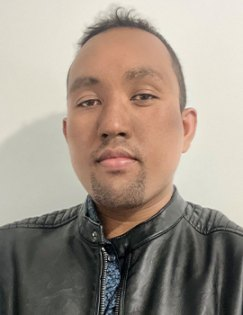

# Daniel Rakotomalala {.hero-name .unnumbered .unlisted}

::: {.hero-body}
[Data scientist and project lead, DEPP]{.hero-role}

Hi. I'm Daniel, a data scientist and data project lead at DEPP, the statistical directorate of the French Ministry of Education. The data project I work on is [IDEE](https://www.idee-education.fr/), Innovations, Données et Expérimentations en Éducation, a programme on innovations, data and experiments in education. I did a PhD in economics, which is where my interest in causal inference comes from. Most of my code is R, and I write packages that make empirical work easier to check and to reproduce.
:::

{.hero-photo fig-alt="Portrait of Daniel Rakotomalala" width=120 height=135}

## Experience and education

::: {.timeline}

::: {.timeline-entry}
::: {.when}
since 2024
:::
::: {.what}
### Data scientist and IDEE project lead {.unnumbered .unlisted}
[DEPP, the statistical directorate of the French Ministry of Education]{.org}

Project lead for the IDEE programme, in partnership with J-PAL Europe; statistical tooling and strategic large-scale data work for the directorate; statistical studies; technical training.
:::
:::

::: {.timeline-entry}
::: {.when}
2022 – 2024
:::
::: {.what}
### Data manager, IDEE programme {.unnumbered .unlisted}
[J-PAL Europe and DEPP]{.org}

Responsible for the administrative-data track of the programme: [public data catalogue](https://catalogue.depp.education.fr/index.php/home) and secure remote-access platform.
:::
:::

::: {.timeline-entry}
::: {.when}
2021 – 2022
:::
::: {.what}
### Teaching assistant in statistics and mathematics {.unnumbered .unlisted}
[Université de La Réunion]{.org}

Undergraduate courses; built programs that generate varied statistics exercises.
:::
:::

::: {.timeline-entry}
::: {.when}
2020 – 2021
:::
::: {.what}
### Statistical studies and evaluation officer {.unnumbered .unlisted}
[Pôle emploi Réunion, regional directorate of the French public employment service]{.org}

Quantitative evaluation of the effect of Pôle emploi employment services on return to work.
:::
:::

::: {.timeline-entry}
::: {.when}
2018 – 2022
:::
::: {.what}
### PhD in economics {.unnumbered .unlisted}
[Université de La Réunion]{.org}

["Essay on some determinants of academic performances in Reunion Island"](https://theses.fr/2022LARE0044), supervised by Yves Croissant.
:::
:::

::: {.timeline-entry}
::: {.when}
2016 – 2017
:::
::: {.what}
### Master's in applied economics, quantitative methods {.unnumbered .unlisted}
[Université de La Réunion]{.org}

Quantitative methods and modelling for business; top of the class.
:::
:::

:::

## Selected projects

::: {#selected-projects}
:::


